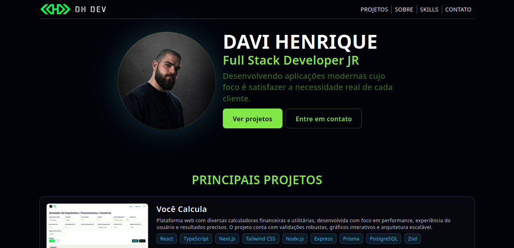

# Davi Henrique - Portfolio



Personal portfolio website built to showcase my projects, skills, and experience as a Full Stack Developer.

The project was developed with a focus on clean design, responsive layout, and a modern user experience.

## 🌐 Live Demo

[https://davihenriquedev.com](https://davihenriquedev.com)

## 🚀 Technologies

- React
- TypeScript
- Vite
- Tailwind CSS
- React Router
- Lucide React

## ✨ Features

- Responsive design for desktop and mobile
- Project showcase with technologies and links
- About page with professional information
- Contact section
- Client-side navigation
- SEO optimized page titles and metadata

## 📂 Project Structure

```

src/
├── components/
├── pages/
├── data/
├── routes/
└── main.tsx

````

## ⚙️ Running locally

Clone the repository:

```bash
git clone https://github.com/davihenriquedev1/portfolio.git
````

Install dependencies:

```bash
npm install
```

Start the development server:

```bash
npm run dev
```

The application will be available at:

```
http://localhost:5173
```

## 📦 Build

To create a production build:

```bash
npm run build
```

## 👨‍💻 Author

**Davi Henrique**

* Website: [https://davihenriquedev.com](https://davihenriquedev.com)
* GitHub: [https://github.com/davihenriquedev1](https://github.com/davihenriquedev1)
* LinkedIn: [https://linkedin.com/in/davihenriquedev](https://linkedin.com/in/davihenriquedev)